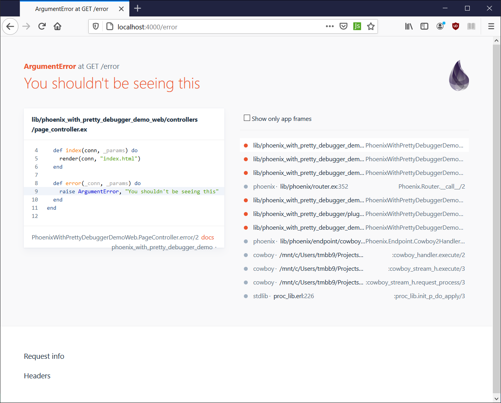
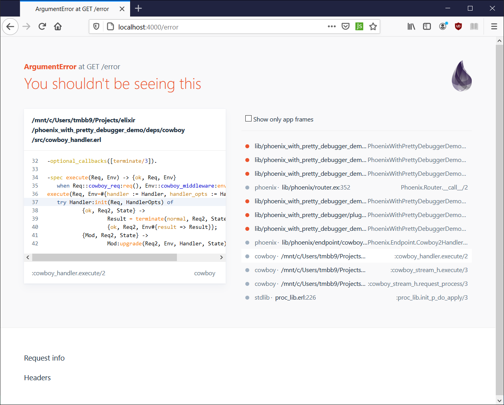

# PhoenixWithPrettyDebugger

Adds support for syntax highlighting in the Phoenix debugger.
To use, replace the following line in your application's endpoint:

```
use Phoenix.Endpoint, otp_app: :your_app
```

by the this line:

```
use PhoenixWithPrettyDebugger.Endpoint, otp_app: :your_app
```

No other changes are needed.
Happy hacking with a prettier debugging experience!

The highlighter supports elixir and erlang by default (so it can even highlight code in the cowboy modules). Internaly this project uses the `makeup` syntax highlighting library and you can add support for other languages by importing the appropriate lexers.

## Example output:

Highlighting Elixir:



Highlighting Erlang:



## Is this safe?!

This library simply defines an alternative to the default `Phoenix.Endpoint` module which is actually API compatible. We reuse as much functionality from that module as possible and only redefine the parts we need to add our new debugger. Becuase the debugger is only used in `:dev` and never in `:prod`

## Installation

If [available in Hex](https://hex.pm/docs/publish), the package can be installed
by adding `phoenix_with_pretty_debugger` to your list of dependencies in `mix.exs`:

```elixir
def deps do
  [
    {:phoenix_with_pretty_debugger, "~> 0.1.0"}
  ]
end
```

Documentation can be generated with [ExDoc](https://github.com/elixir-lang/ex_doc)
and published on [HexDocs](https://hexdocs.pm). Once published, the docs can
be found at [https://hexdocs.pm/phoenix_with_pretty_debugger](https://hexdocs.pm/phoenix_with_pretty_debugger).

